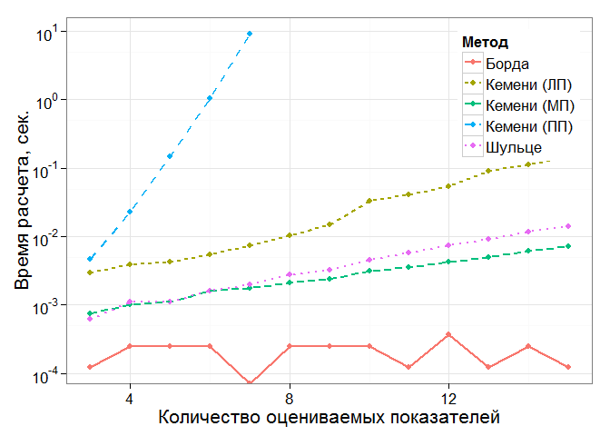

# Медиана Кемени
Тушавин В. А.  
15 декабря 2015 г.  

### Расчет методом Шульце


```r
library(gtools)
library(lpSolve)
rm(list=ls())
# Функция, определяющая силу самого сильного пути
# по методу Шульце


Schulze<-function(ranks) {
  n_voters<-nrow(ranks)
  n_candidates<-ncol(ranks)
  mtx<-matrix(data=0,nrow=n_candidates,ncol=n_candidates)
  for(i in 1:n_voters)
    for(j in 1:(n_candidates-1))
      mtx[ranks[i,j]+1,ranks[i,c((j+1):n_candidates)]+1]<-mtx[ranks[i,j]+1,ranks[i,c((j+1):n_candidates)]+1]+1
        
  result<-matrix(data=0,nrow=n_candidates,ncol=n_candidates)
  for(i in 1:n_candidates)
    for(j in 1:n_candidates)
      if(i!=j) result[i,j]<-ifelse(mtx[i,j] > mtx[j,i],mtx[i,j],0)
  for(i in 1:n_candidates)
    for(j in 1:n_candidates)
      if(i!=j) for(k in 1:n_candidates)
        if(i!=k & j !=k) result[j,k]<-max(result[j,k],
                                          min(result[j,i],result[i,k]))
    vec<-rep(0,n_candidates)
    for(k in 1:nrow(z<-combinations(n_candidates,2))) {
      i=z[k,1]
      j=z[k,2]
      if(result[i,j]>result[j,i]) 
        vec[j]<-vec[j]+1
      else if(result[i,j]<result[j,i])
        vec[i]<-vec[i]+1
    }
    return(list(mtx=result,best_rank=order(vec)-1))
} 
```

### Расчет методом Кемени-Янга


```r
# Нахождение расстояния между оценками
kendall_tau<-function(rank.a,rank.b) {
  tau<-0
  n<-length(rank.a)
  for(k in 1:ncol(z<-combn(n,2))) {
    i=z[1,k]
    j=z[2,k]
    tau<-tau+(sign(rank.a[i]-rank.a[j]) == -sign(rank.b[i]-rank.b[j]))
  } 
  return(tau)
}


# Построение графа
build_graph<-function(ranks) {
  n_voters<-nrow(ranks)
  n_candidates<-ncol(ranks)
  edge_weights<-matrix(0,nrow=n_candidates,ncol=n_candidates)
  for(k in 1:ncol(z<-combn(n_candidates,2))) {
    i=z[1,k]
    j=z[2,k]
    preference<-ranks[, i] - ranks[, j]
    h.ij <- sum(preference < 0) 
    h.ji <- sum(preference > 0)
    if(h.ij > h.ji) edge_weights[i, j] <- h.ij - h.ji else if(h.ij < h.ji) edge_weights[j, i] <- h.ji - h.ij
  }
  return(edge_weights)
}

# Нахождение медианы Кемени посредством решения задачи ЛП
rank_solve<-function(ranks) {
  n_voters<-nrow(ranks)
  n_candidates<-ncol(ranks)
  # Строим граф
  edge_weights<-build_graph(ranks)
  # Задаем параметры. 
  # Коээфициенты при целевой функции
  objective.in<- as.vector(t(edge_weights))
  # Коэффициенты для каждой пары
  pairwise_constraints <- matrix(0,
                                 n_candidates * (n_candidates - 1) / 2, n_candidates ^ 2)
  for(k in 1:nrow(z<-combinations(n_candidates,2))) {
    i=z[k,1]
    j=z[k,2] 
    pairwise_constraints[k,c((i-1)*n_candidates+j,(j-1)*n_candidates+i)]<-1
  }
  # Коэффициенты для каждой тройки
  triangle_constraints <-matrix(0,n_candidates *
                                  (n_candidates - 1) *
                                  (n_candidates - 2), n_candidates ^ 2)
  
  for(m in 1:nrow(z<-permutations(n_candidates,3))) {
    i=z[m,1]
    j=z[m,2]
    k=z[m,3]
    triangle_constraints[m,c((i-1)*n_candidates+j,(j-1)*n_candidates+k,(k-1)*n_candidates+i)]<-1
  }
  constraints<-rbind(pairwise_constraints,triangle_constraints)
  constraint_rhs<-rep(1,nrow(pairwise_constraints)+nrow(triangle_constraints))
  constraint_signs<-c(rep("==",nrow(pairwise_constraints)),rep(">=",nrow(triangle_constraints)))
  z<-lp("min",objective.in, constraints, constraint_signs, constraint_rhs,all.int=T) 
  x<-matrix(z$solution,nrow=n_candidates,ncol=n_candidates,byrow=T)
  best_rank<-apply(x,1,sum)
  tau<-sum(apply(ranks,1,function(x){kendall_tau(x,best_rank)}))
  return(list(min_dist=tau,best_rank=best_rank))
}


# Нахождение медианы Кемени посредством полного перебора
rankaggr_brute<-function(ranks) {
  min_dist<-Inf
  best_rank <-NA
  n_voters<-nrow(ranks)
  n_candidates<-ncol(ranks)
  data<-permutations(n_candidates,n_candidates)-1
  for(k in 1:nrow(data)) {
    dist<-sum(apply(ranks,1,function(x){kendall_tau(x,data[k,])}))
    if (dist < min_dist) {
      min_dist <- dist
      best_rank <- data[k,]
    }}
  return(list(min_dist=min_dist,best_rank=best_rank))  
}

# Нахождение медианы Кемени посредством перебора из существующих вариантов
rankaggr_brute_mod<-function(ranks) {
  min_dist<-Inf
  best_rank <-NA
  n_voters<-nrow(ranks)
  n_candidates<-ncol(ranks)
  for(i in 1:n_voters){
    dist<-sum(apply(ranks,1,function(x){kendall_tau(x,ranks[i,])}))
    if (dist < min_dist) {
      min_dist <- dist
      best_rank <- ranks[i,]
    }
  return(list(min_dist=min_dist,best_rank=best_rank))  
}}
```

### Расчет методом Борда


```r
# Нахождение результата методом Борда
Borda<-function(ranks,mthd=1) {
  n_voters<-nrow(ranks)
  n_candidates<-ncol(ranks)
  if(mthd==1) 
    x<-apply(n_candidates-ranks,2,sum)
  else if (mthd==2)
    x<-apply(n_candidates-ranks-1,2,sum)
  else
    x<-apply((ranks+1)/n_candidates,2,sum)
  best_rank=order(x,decreasing=T)-1
  return(list(best_rank=best_rank,wgt=x[best_rank+1]))
}
```

### Тестирование алгоритмов

Для тестирования алгоритма использован пример из [статьи на Wikipedia](
https://ru.wikipedia.org/wiki/%D0%9C%D0%B5%D1%82%D0%BE%D0%B4_%D0%A8%D1%83%D0%BB%D1%8C%D1%86%D0%B5)


```r
# Вычисление тестового примера

ranks<-matrix(c(rep(c(0,2,1,4,3),5),
                rep(c(0,3,4,2,1),5),
                rep(c(1,4,3,0,2),8),
                rep(c(2,0,1,4,3),3),
                rep(c(2,0,4,1,3),7),
                rep(c(2,1,0,3,4),2),
                rep(c(3,2,4,1,0),7),
                rep(c(4,1,0,3,2),8)),byrow=T,ncol=5)

rankaggr_brute(ranks)
```

```
## $min_dist
## [1] 188
## 
## $best_rank
## [1] 2 0 4 1 3
```

```r
rankaggr_brute_mod(ranks)
```

```
## $min_dist
## [1] 218
## 
## $best_rank
## [1] 0 2 1 4 3
```

```r
rank_solve(ranks)
```

```
## $min_dist
## [1] 188
## 
## $best_rank
## [1] 2 0 4 1 3
```

```r
Borda(ranks,1)
```

```
## $best_rank
## [1] 1 0 3 4 2
## 
## $wgt
## [1] 144 140 139 135 117
```

```r
Borda(ranks,2)
```

```
## $best_rank
## [1] 1 0 3 4 2
## 
## $wgt
## [1] 99 95 94 90 72
```

```r
Borda(ranks,3)
```

```
## $best_rank
## [1] 2 4 3 0 1
## 
## $wgt
## [1] 30.6 27.0 26.2 26.0 25.2
```

```r
Schulze(ranks)
```

```
## $mtx
##      [,1] [,2] [,3] [,4] [,5]
## [1,]    0   28   28   30   24
## [2,]   25    0   28   33   24
## [3,]   25   29    0   29   24
## [4,]   25   28   28    0   24
## [5,]   25   28   28   31    0
## 
## $best_rank
## [1] 4 0 2 1 3
```

```r
#  Тест по времени
set.seed(1968)
d.len<-c()
d.n<-c()
d.mth<-c()
d.time<-c()

for(rank_len in 3:15)
  for(n_ranks in c(5,10,15,20)) {
    ranks<-c()
    for(i in 1:n_ranks) ranks<-c(ranks,sample(1:rank_len,rank_len))
    ranks<-matrix(ranks,ncol=rank_len,byrow=T)-1
    
    if(rank_len<8) { # Дальше полный перебор идет слишком долго
    start.time <- Sys.time()
    z<-rankaggr_brute(ranks)
    end.time <- Sys.time()
    time.taken <-end.time - start.time
    d.len<-c(d.len,rank_len)
    d.n<-c(d.n,n_ranks)
    d.mth<-c(d.mth,"Кемени (ПП)")
    d.time<-c(d.time,as.numeric(time.taken))
    }
    
     start.time <- Sys.time()
    z<-rankaggr_brute_mod(ranks)
    end.time <- Sys.time()
    time.taken <- end.time - start.time
    d.len<-c(d.len,rank_len)
    d.n<-c(d.n,n_ranks)
    d.mth<-c(d.mth,"Кемени (МП)")
    d.time<-c(d.time,as.numeric(time.taken))
    
    start.time <- Sys.time()
    z<-rank_solve(ranks)
    end.time <- Sys.time()
    time.taken <- end.time - start.time
    d.len<-c(d.len,rank_len)
    d.n<-c(d.n,n_ranks)
    d.mth<-c(d.mth,"Кемени (ЛП)")
    d.time<-c(d.time,as.numeric(time.taken))
    
    start.time <- Sys.time()
    z<-Borda(ranks)
    end.time <- Sys.time()
    time.taken <- end.time - start.time
    d.len<-c(d.len,rank_len)
    d.n<-c(d.n,n_ranks)
    d.mth<-c(d.mth,"Борда")
    d.time<-c(d.time,as.numeric(time.taken))
    
    start.time <- Sys.time()
    z<-Schulze(ranks)
    end.time <- Sys.time()
    time.taken <- end.time - start.time
    d.len<-c(d.len,rank_len)
    d.n<-c(d.n,n_ranks)
    d.mth<-c(d.mth,"Шульце")
    d.time<-c(d.time,as.numeric(time.taken))
    
  }

library(ggplot2)
library(scales)
mydata<-data.frame(Показателей=d.len,Экспертов=d.n,Время=d.time,Метод=d.mth)
mydata$Экспертов<-as.factor(mydata$Экспертов)
mydata$Метод<-as.factor(mydata$Метод)
g<-ggplot(aggregate(Время~Показателей+Метод,data=mydata,mean),aes(x=Показателей,y=Время,linetype=Метод,col=Метод))+
  geom_point()+
  geom_line(size=1)+
  scale_y_log10(breaks=trans_breaks("log10",function(x) 10^x),
                labels=trans_format("log10",math_format(10^.x)),
                minor_breaks=log10(5)+-4:1)+
  xlab("Количество оцениваемых показателей")+ylab("Время расчета, сек.")
g<-g+theme_bw(base_size = 16)
g+theme(legend.position=c(1,1),legend.justification=c(1,1))
```

 

## Решение практической задачи


```r
# Исходные данные
mydata<-matrix(c(6.00,9.50,9.90,7.00,7.00,8.00,
7.00,9.84,10.00,10.00,8.00,10.00,
6.00,10.00,10.00,6.00,8.00,10.00,
6.00,10.00,9.50,7.00,8.00,9.00,
6.89,9.59,10.00,6.00,7.00,8.00,
7.00,10.00,10.00,8.00,6.00,9.00,
6.00,9.10,10.00,8.00,5.00,8.00,
7.50,9.81,10.00,9.00,9.00,7.00),byrow=T,ncol=6)
mydata<-as.data.frame(mydata)
names(mydata)<-paste0("Q",1:6)
mydata$Qm<-apply(mydata,1,mean)
knitr::kable(mydata,digits =2)
```


   Q1      Q2     Q3   Q4   Q5   Q6     Qm
-----  ------  -----  ---  ---  ---  -----
 6.00    9.50    9.9    7    7    8   7.90
 7.00    9.84   10.0   10    8   10   9.14
 6.00   10.00   10.0    6    8   10   8.33
 6.00   10.00    9.5    7    8    9   8.25
 6.89    9.59   10.0    6    7    8   7.91
 7.00   10.00   10.0    8    6    9   8.33
 6.00    9.10   10.0    8    5    8   7.68
 7.50    9.81   10.0    9    9    7   8.72

Функция преобразования шкал и преобразование


```r
convert.scale<-function(bad,good,val) {
  x1=bad
  x2=good
  x3=2*good-bad
  y1=0
  y2=1
  y3=0
  a<-(y3-(x3*(y2-y1)+x2*y1-x1*y2)/(x2-x1))/(x3*(x3-x1-x2)+x1*x2)
  b<-(y2-y1)/(x2-x1)-a*(x1+x2)
  c<-(x2*y1-x1*y2)/(x2-x1)+a*x1*x2
  y=a*val*val+b*val+c
  return(ifelse(y>0,y,0))
}

for(i in 1:nrow(mydata)) for (j in 1:(ncol(mydata)-1))
        mydata[i,j]<-convert.scale(1,10,mydata[i,j])
mydata$Qm<-apply(mydata,1,mean)
knitr::kable(mydata,digits=4)
```

     Q1       Q2       Q3       Q4       Q5       Q6       Qm
-------  -------  -------  -------  -------  -------  -------
 0.8025   0.9969   0.9999   0.8889   0.8889   0.9506   1.9182
 0.8889   0.9997   1.0000   1.0000   0.9506   1.0000   2.1399
 0.8025   1.0000   1.0000   0.8025   0.9506   1.0000   1.9841
 0.8025   1.0000   0.9969   0.8889   0.9506   0.9877   1.9824
 0.8806   0.9979   1.0000   0.8025   0.8889   0.9506   1.9191
 0.8889   1.0000   1.0000   0.9506   0.8025   0.9877   1.9947
 0.8025   0.9900   1.0000   0.9506   0.6914   0.9506   1.8669
 0.9228   0.9996   1.0000   0.9877   0.9877   0.8889   2.0721

Функция генерации случайных весов


```r
set.seed(2014)
library(gtools)
rpoly<-function(n=1, size=2,test=data.frame()) {
  mtx<-rdirichlet(n,rep(1,size))
  if(length(test)==0) return(mtx) 
  for(j in 1:n) {
    while(TRUE) {
     flag=TRUE
      for(i in 1:nrow(test)) {
      if(mtx[j,test$master[i]]<mtx[j,test$slave[i]]) {
        tmp<-mtx[j,test$slave[i]]
        mtx[j,test$slave[i]]<-mtx[j,test$master[i]]
        mtx[j,test$master[i]]<-tmp
        flag=FALSE
      }

      }
   if(flag) break
  }
}
return(mtx)
}
```

Генерация случайных весов с учетом ограничения:
P5>P1, P5>P2, P5>P3, P5>P4; P2>P1, P2>P3, P2>P4; P1>P3, P1>P4


```r
mtx<-rpoly(1000, 5, data.frame(master=c(5,5,5,5,2,2,2,1,1),slave=c(1,2,3,4,1,3,4,3,4)))
knitr::kable(summary(mtx))
```

           V1                 V2                V3                  V4                  V5       
---  -----------------  ----------------  ------------------  ------------------  ---------------
     Min.   :0.009221   Min.   :0.05839   Min.   :8.818e-05   Min.   :8.348e-05   Min.   :0.2450 
     1st Qu.:0.117590   1st Qu.:0.21728   1st Qu.:1.705e-02   1st Qu.:4.370e-02   1st Qu.:0.3657 
     Median :0.158201   Median :0.26043   Median :3.989e-02   Median :7.212e-02   Median :0.4425 
     Mean   :0.156594   Mean   :0.25911   Mean   :4.948e-02   Mean   :7.812e-02   Mean   :0.4567 
     3rd Qu.:0.198350   3rd Qu.:0.30305   3rd Qu.:7.045e-02   3rd Qu.:1.097e-01   3rd Qu.:0.5296 
     Max.   :0.304276   Max.   :0.43814   Max.   :2.374e-01   Max.   :2.249e-01   Max.   :0.8879 

Рассчитаем матрицу рангов 


```r
mtx.new<-matrix(0,nrow=1000,ncol=6)
for(i in 1:6){
  mtx.new[,i]<-apply(mtx,1,FUN=function(x) sum(x*mydata[i,1:6]))
  
}
library(foreach)
```

```
## Warning: package 'foreach' was built under R version 3.2.3
```

```r
ranks<-foreach(i=1:1000, .combine='rbind') %do% order(mtx.new[i,],decreasing =T)-1
knitr::kable(head(ranks),col.names =paste0("X",1:6))
```

            X1   X2   X3   X4   X5   X6
---------  ---  ---  ---  ---  ---  ---
result.1     1    3    2    4    0    5
result.2     1    3    2    4    0    5
result.3     1    3    2    4    0    5
result.4     1    3    2    4    5    0
result.5     1    3    2    4    0    5
result.6     1    3    2    4    0    5

Расчет методом Шульце и медианы Кемени


```r
rank_solve(ranks)
```

```
## $min_dist
## [1] 2377
## 
## $best_rank
## [1] 1 3 2 4 0 5
```

```r
Schulze(ranks)
```

```
## $mtx
##      [,1] [,2] [,3] [,4] [,5] [,6]
## [1,]    0    0    0    0    0  766
## [2,] 1000    0 1000 1000 1000 1000
## [3,] 1000    0    0    0 1000  982
## [4,] 1000    0  882    0 1000 1000
## [5,]  918    0    0    0    0  889
## [6,]    0    0    0    0    0    0
## 
## $best_rank
## [1] 1 3 2 4 0 5
```

Информация о параметрах R


```r
sessionInfo()
```

```
## R version 3.2.2 (2015-08-14)
## Platform: x86_64-w64-mingw32/x64 (64-bit)
## Running under: Windows 8 x64 (build 9200)
## 
## locale:
## [1] LC_COLLATE=Russian_Russia.1251  LC_CTYPE=Russian_Russia.1251   
## [3] LC_MONETARY=Russian_Russia.1251 LC_NUMERIC=C                   
## [5] LC_TIME=Russian_Russia.1251    
## 
## attached base packages:
## [1] stats     graphics  grDevices utils     datasets  methods   base     
## 
## other attached packages:
## [1] foreach_1.4.3  scales_0.3.0   ggplot2_1.0.1  lpSolve_5.6.13
## [5] gtools_3.5.0  
## 
## loaded via a namespace (and not attached):
##  [1] Rcpp_0.12.2      knitr_1.11       magrittr_1.5     MASS_7.3-45     
##  [5] munsell_0.4.2    colorspace_1.2-6 stringr_1.0.0    highr_0.5.1     
##  [9] plyr_1.8.3       tools_3.2.2      grid_3.2.2       gtable_0.1.2    
## [13] iterators_1.0.8  htmltools_0.2.6  yaml_2.1.13      digest_0.6.8    
## [17] reshape2_1.4.1   formatR_1.2.1    codetools_0.2-14 evaluate_0.8    
## [21] rmarkdown_0.8.1  labeling_0.3     stringi_1.0-1    compiler_3.1.3  
## [25] proto_0.3-10
```


