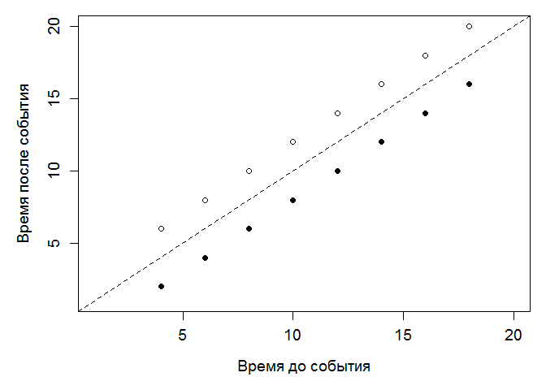
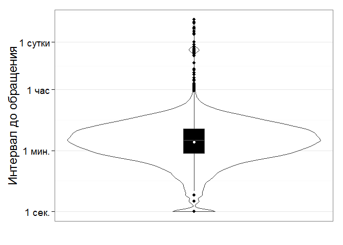
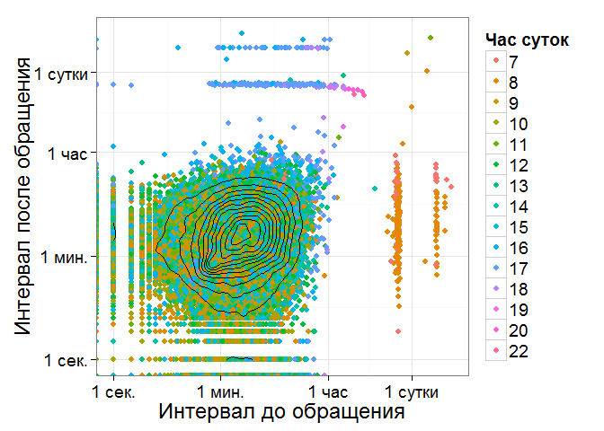
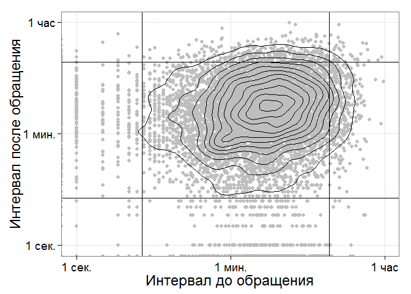
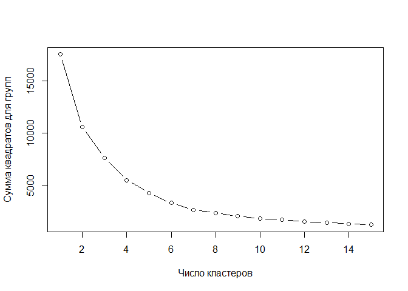

# Методика визуализации потока обращений
Тушавин В. А.  
19 декабря 2015 г.  

## Тестовый график


```r
x1<-cumsum((1:10)*2)
z1<-diff(x1)
x2<-cumsum((10:1)*2)
z2<-diff(x2)
par(mar=c(5,5,1,1))

plot(z1[1:8],z1[2:9],xlim=c(1,20),ylim=c(1,20),xlab="Время до события",ylab="Время после события",cex.lab=1.2,cex.axis=1.2)
points(z2[1:8],z2[2:9],pch=19)
abline(a=0,b=1,lty=2)
```

 

## Рисунки для полных данных


```r
library(ggplot2)
library(scales)
library(readxl)
xls.data<-read_excel("datafile.xlsx")
dim(xls.data)
```

```
## [1] 39007    29
```

```r
summary(xls.data)
```

```
##        id           actualcost    actualduration   
##  Min.   :339305   Min.   : NA     Min.   : 0.0000  
##  1st Qu.:349239   1st Qu.: NA     1st Qu.: 0.0177  
##  Median :359086   Median : NA     Median : 0.1052  
##  Mean   :359080   Mean   :NaN     Mean   : 0.5506  
##  3rd Qu.:368938   3rd Qu.: NA     3rd Qu.: 0.3454  
##  Max.   :378890   Max.   : NA     Max.   :81.6723  
##                   NA's   :39007   NA's   :871      
##   actualfinish                  actualstart                 
##  Min.   :2015-01-01 12:44:56   Min.   :2015-01-03 08:17:47  
##  1st Qu.:2015-03-23 19:51:01   1st Qu.:2015-03-20 11:17:18  
##  Median :2015-06-15 16:24:20   Median :2015-06-11 11:55:23  
##  Mean   :2015-06-17 04:41:07   Mean   :2015-06-15 07:41:35  
##  3rd Qu.:2015-09-11 08:12:56   3rd Qu.:2015-09-09 11:44:29  
##  Max.   :2015-12-17 10:59:22   Max.   :2015-12-02 15:42:22  
##                                NA's   :868                  
##     deadline                   impact_object_id   
##  Min.   :2015-01-12 13:03:38   Min.   :3.095e+09  
##  1st Qu.:2015-03-25 14:19:55   1st Qu.:3.095e+09  
##  Median :2015-06-17 15:10:54   Median :3.095e+09  
##  Mean   :2015-06-19 13:58:41   Mean   :3.095e+09  
##  3rd Qu.:2015-09-14 13:55:09   3rd Qu.:3.095e+09  
##  Max.   :2016-03-15 17:03:00   Max.   :3.095e+09  
##                                                   
##  callerorganization_object_id   service_id         sla_id     
##  Min.   :2.815e+14            Min.   :  1.00   Min.   : 2.00  
##  1st Qu.:2.815e+14            1st Qu.: 28.00   1st Qu.: 4.00  
##  Median :2.815e+14            Median : 64.00   Median :11.00  
##  Mean   :2.815e+14            Mean   : 97.96   Mean   :11.71  
##  3rd Qu.:2.815e+14            3rd Qu.:195.00   3rd Qu.:18.00  
##  Max.   :2.815e+14            Max.   :242.00   Max.   :37.00  
##                               NA's   :12       NA's   :7833   
##  assignorperson_object_id assignorworkgroup_object_id
##  Min.   :2.815e+14        Min.   :2.815e+14          
##  1st Qu.:2.815e+14        1st Qu.:2.815e+14          
##  Median :2.815e+14        Median :2.815e+14          
##  Mean   :2.815e+14        Mean   :2.815e+14          
##  3rd Qu.:2.815e+14        3rd Qu.:2.815e+14          
##  Max.   :2.815e+14        Max.   :2.815e+14          
##                                                      
##  assigneeperson_object_id assworkgroup_object_id
##  Min.   :2.815e+14        Min.   :2.815e+14     
##  1st Qu.:2.815e+14        1st Qu.:2.815e+14     
##  Median :2.815e+14        Median :2.815e+14     
##  Mean   :2.815e+14        Mean   :2.815e+14     
##  3rd Qu.:2.815e+14        3rd Qu.:2.815e+14     
##  Max.   :2.815e+14        Max.   :2.815e+14     
##                                                 
##     created                     Apr_Out_Time   Compl_Time     
##  Min.   :2015-01-01 12:44:47   Min.   :0     Min.   :      0  
##  1st Qu.:2015-03-20 10:38:30   1st Qu.:0     1st Qu.:  97200  
##  Median :2015-06-10 16:07:20   Median :0     Median :  97200  
##  Mean   :2015-06-14 23:39:23   Mean   :0     Mean   :  99707  
##  3rd Qu.:2015-09-09 09:29:13   3rd Qu.:0     3rd Qu.: 129600  
##  Max.   :2015-11-30 17:04:29   Max.   :0     Max.   :1628377  
##                                                               
##     Reg_Time         Wait_Time         Work_Time            rate      
##  Min.   :      0   Min.   :      0   Min.   :      0   Min.   :1.000  
##  1st Qu.:      0   1st Qu.:      0   1st Qu.:   1259   1st Qu.:3.000  
##  Median :     60   Median :      0   Median :   7807   Median :3.000  
##  Mean   :   3022   Mean   :  12577   Mean   :  34527   Mean   :3.523  
##  3rd Qu.:    483   3rd Qu.:      0   3rd Qu.:  27207   3rd Qu.:5.000  
##  Max.   :1219029   Max.   :4679179   Max.   :6982327   Max.   :5.000  
##                                                        NA's   :25775  
##       cnt             Срок           Не вовремя          Время          
##  Min.   : 1.00   Min.   :0.00000   Min.   :0.00000   Min.   :   0.0000  
##  1st Qu.: 1.00   1st Qu.:0.00000   1st Qu.:0.00000   1st Qu.:   0.3663  
##  Median : 1.00   Median :0.00000   Median :0.00000   Median :   2.3635  
##  Mean   : 1.56   Mean   :0.02751   Mean   :0.02751   Mean   :  12.9183  
##  3rd Qu.: 1.00   3rd Qu.:0.00000   3rd Qu.:0.00000   3rd Qu.:   8.1175  
##  Max.   :54.00   Max.   :1.00000   Max.   :1.00000   Max.   :1960.1354  
##  NA's   :32333                                                          
##    Переносов         ЛогВремяЧ            GOOD            Month       
##  Min.   : 0.0000   Min.   :-3.6310   Min.   :0.0000   Min.   : 1.000  
##  1st Qu.: 0.0000   1st Qu.:-0.3517   1st Qu.:1.0000   1st Qu.: 3.000  
##  Median : 0.0000   Median : 0.4106   Median :1.0000   Median : 6.000  
##  Mean   : 0.2665   Mean   : 0.2149   Mean   :0.8086   Mean   : 5.942  
##  3rd Qu.: 0.0000   3rd Qu.: 0.9218   3rd Qu.:1.0000   3rd Qu.: 9.000  
##  Max.   :54.0000   Max.   : 3.2923   Max.   :1.0000   Max.   :11.000  
##                    NA's   :1174
```

```r
mydata<-xls.data[,c(1,3,9,15)]
mydata[is.na(mydata[,2]),2]<-0
mydata[is.na(mydata[,3]),3]<-0
mydata[,3]<-as.factor(mydata[,3])
max.idx<-nrow(mydata)

dim(mydata)
```

```
## [1] 39007     4
```

```r
summary(mydata)
```

```
##        id         actualduration       service_id   
##  Min.   :339305   Min.   : 0.00000   12     : 7959  
##  1st Qu.:349239   1st Qu.: 0.01526   28     : 3223  
##  Median :359086   Median : 0.09848   197    : 2488  
##  Mean   :359080   Mean   : 0.53826   104    : 2279  
##  3rd Qu.:368938   3rd Qu.: 0.33823   61     : 1948  
##  Max.   :378890   Max.   :81.67231   216    : 1711  
##                                      (Other):19399  
##     created                   
##  Min.   :2015-01-01 12:44:47  
##  1st Qu.:2015-03-20 10:38:30  
##  Median :2015-06-10 16:07:20  
##  Mean   :2015-06-14 23:39:23  
##  3rd Qu.:2015-09-09 09:29:13  
##  Max.   :2015-11-30 17:04:29  
## 
```

```r
head(mydata)
```

```
##       id actualduration service_id             created
## 1 339305              0        104 2015-01-01 12:44:47
## 2 339307              0        153 2015-01-03 08:14:58
## 3 339308              0        122 2015-01-04 08:44:48
## 4 339311              0        122 2015-01-05 08:15:59
## 5 339309              0        236 2015-01-04 14:43:07
## 6 339310              0        236 2015-01-04 14:57:30
```

```r
mydata<-mydata[order(mydata$created),]
lag<-as.numeric(diff(mydata$created))
graph<-data.frame(x=lag[1:(max.idx-2)],y=lag[2:(max.idx-1)], hour=as.numeric(format(mydata$created[2:(max.idx-1)],"%H")),
wd=as.numeric(format(mydata$created[2:(max.idx-1)],"%u")))

ggplot(graph,aes(x=1,y=x))+geom_violin()+
  geom_boxplot(width=0.1,fill="black")+
  theme(axis.title.x=element_blank())+
  scale_y_log10(breaks=c(1,60,3600,3600*24),labels=c("1 cек.","1 мин.", "1 час", "1 сутки"))+
  stat_summary(fun.y=median,geom="point",fill="white",shape=21,size=2.5)+
  scale_x_continuous(breaks=NULL)+
  labs(x="",y="Интервал до обращения")+
  theme_bw(base_size = 18) 
```

 

```r
g<-ggplot(graph,aes(x=x,y=y,col=as.factor(hour)))+
  geom_point()+
  scale_x_log10(breaks=c(1,60,3600,3600*24),
                labels=c("1 cек.","1 мин.", "1 час", "1 сутки"))+
  scale_y_log10(breaks=c(1,60,3600,3600*24),
                labels=c("1 cек.","1 мин.", "1 час", "1 сутки"))+
  stat_density2d(col="black")+
  scale_color_discrete(name = "Час суток")+
  labs(x="Интервал до обращения",y="Интервал после обращения")
g+theme_bw(base_size = 18)  #+theme(legend.position='none')
```

 

```r
median(graph$x)
```

```
## [1] 106
```

```r
median(graph$y)
```

```
## [1] 106
```

```r
mean(graph$x)
```

```
## [1] 738.0113
```

```r
sd(graph$x)
```

```
## [1] 9214.03
```

```r
mean(graph$y)
```

```
## [1] 734.0128
```

```r
sd(graph$y)
```

```
## [1] 9180.163
```


```r
UCL<-function(x,alpha=0.05) log(alpha/2)/log(1-1/x)-1
LCL<-function(x,alpha=0.05) log(1-alpha/2)/log(1-1/x)
```

## Проверка распределения


```r
library(ADGofTest)
test<-subset(graph,wd>1 & wd<6 & hour>11 & hour<15)
dim(test)
```

```
## [1] 8754    4
```

```r
mean(test$x)
```

```
## [1] 224.5441
```

```r
sd(test$x)
```

```
## [1] 290.0465
```

```r
set.seed(2015)
z<-sample(test$x,50)  
print(ad.test(z,pgeom,1/mean(test$x)))
```

```
## 
## 	Anderson-Darling GoF Test
## 
## data:  z  and  pgeom
## AD = 0.96242, p-value = 0.3772
## alternative hypothesis: NA
```

```r
LCL(mean(test$x))
```

```
## [1] 5.672296
```

```r
UCL(mean(test$x))
```

```
## [1] 825.4703
```

## Рисунок для выборки

```r
g<-ggplot(test,aes(x=x,y=y))+
  geom_point(col="grey")+
  scale_x_log10(breaks=c(1,60,3600,3600*24),
                labels=c("1 cек.","1 мин.",  "1 час", "1 сутки"))+
  scale_y_log10(breaks=c(1,60,3600,3600*24),
                labels=c("1 cек.","1 мин.", "1 час", "1 сутки"))+
  stat_density2d(col="black")+
  geom_hline(aes(yintercept=c(LCL(mean(test$x)),UCL(mean(test$x)))))+
  geom_vline(aes(xintercept=c(LCL(mean(test$x)),UCL(mean(test$x)))))+
  labs(x="Интервал до обращения",y="Интервал после обращения") 
g+theme_bw(base_size = 18)
```

```
## Warning: Removed 784 rows containing non-finite values (stat_density2d).
```

 

### Определение числа кластеров


```r
wssplot <- function(data, nc=15, seed=1234){
               wss <- (nrow(data)-1)*sum(apply(data,2,var))
               for (i in 2:nc){
                    set.seed(seed)
                    wss[i] <- sum(kmeans(data, centers=i)$withinss)}
                plot(1:nc, wss, type="b", xlab="Число кластеров",
                     ylab="Сумма квадратов для групп")}

ktest<-scale(log(test[,1:2]+1))
wssplot(ktest)
```

 


### Информация о параметрах R


```r
sessionInfo()
```

```
## R version 3.2.2 (2015-08-14)
## Platform: x86_64-w64-mingw32/x64 (64-bit)
## Running under: Windows 8 x64 (build 9200)
## 
## locale:
## [1] LC_COLLATE=Russian_Russia.1251  LC_CTYPE=Russian_Russia.1251   
## [3] LC_MONETARY=Russian_Russia.1251 LC_NUMERIC=C                   
## [5] LC_TIME=Russian_Russia.1251    
## 
## attached base packages:
## [1] stats     graphics  grDevices utils     datasets  methods   base     
## 
## other attached packages:
## [1] ADGofTest_0.3 readxl_0.1.0  scales_0.3.0  ggplot2_1.0.1
## 
## loaded via a namespace (and not attached):
##  [1] Rcpp_0.12.2      digest_0.6.8     MASS_7.3-45      grid_3.2.2      
##  [5] plyr_1.8.3       gtable_0.1.2     formatR_1.2.1    magrittr_1.5    
##  [9] evaluate_0.8     stringi_1.0-1    reshape2_1.4.1   rmarkdown_0.8.1 
## [13] proto_0.3-10     tools_3.2.2      stringr_1.0.0    munsell_0.4.2   
## [17] yaml_2.1.13      colorspace_1.2-6 htmltools_0.2.6  knitr_1.11
```

