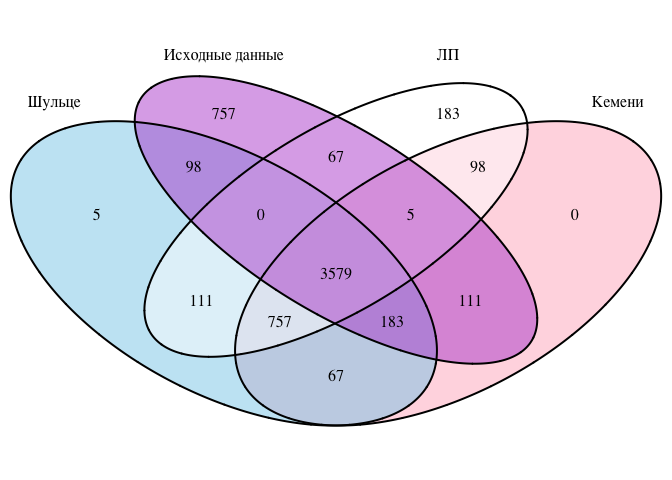
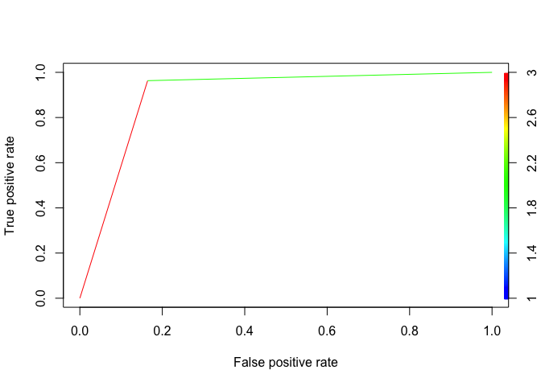

# Сравнение подходов к ранжированию
Тушавин В. А.  
4 января 2016 г.  

Целью настоящего исследования является сравнение алгоритмов ранжирования объектов с точки зрения их эффективности.

Сравниваются три алгоритма. Два из них были ранее описаны в статье Тушавин В. А. Ранжирование показателей качества с использованием методов Кемени-Янга и Шульце //Экономика и менеджмент систем управления. 2005. № 4.4.

Третий - быстрый алгоритм нахождения медианы Кемени из пакета `ConsRank`.

### Определение библиотек и функций


```r
library(ggplot2)
library(scales)
library(gtools)
library(ConsRank)
```

```
## Loading required package: MASS
## Loading required package: proxy
## 
## Attaching package: 'proxy'
## 
## Следующие объекты скрыты от 'package:stats':
## 
##     as.dist, dist
## 
## Следующий объект скрыт от 'package:base':
## 
##     as.matrix
## 
## Loading required package: rgl
## 
## Attaching package: 'ConsRank'
## 
## Следующий объект скрыт от 'package:base':
## 
##     labels
```

```r
library(lpSolve)
library(irr)
library(reshape2)
library(VennDiagram)
```

```
## Loading required package: grid
## Loading required package: futile.logger
## 
## Attaching package: 'futile.logger'
## 
## Следующий объект скрыт от 'package:gtools':
## 
##     scat
```

```r
library(rpart)
library(rpart.plot)
library(caret)
```

```
## Loading required package: lattice
```

```r
library(ROCR)
```

```
## Loading required package: gplots
## 
## Attaching package: 'gplots'
## 
## Следующий объект скрыт от 'package:stats':
## 
##     lowess
```

```r
# Функции для нахождения медианы Кемени
# Нахождение расстояния между оценками
kendall_tau<-function(rank.a,rank.b) {
  tau<-0
  n<-length(rank.a)
  for(k in 1:ncol(z<-combn(n,2))) {
    i=z[1,k]
    j=z[2,k]
    tau<-tau+(sign(rank.a[i]-rank.a[j]) == -sign(rank.b[i]-rank.b[j]))
  } 
  return(tau)
}


# Построение графа
build_graph<-function(ranks) {
  n_voters<-nrow(ranks)
  n_candidates<-ncol(ranks)
  edge_weights<-matrix(0,nrow=n_candidates,ncol=n_candidates)
  for(k in 1:ncol(z<-combn(n_candidates,2))) {
    i=z[1,k]
    j=z[2,k]
    preference<-ranks[, i] - ranks[, j]
    h.ij <- sum(preference < 0) 
    h.ji <- sum(preference > 0)
    if(h.ij > h.ji) edge_weights[i, j] <- h.ij - h.ji else if(h.ij < h.ji) edge_weights[j, i] <- h.ji - h.ij
  }
  return(edge_weights)
}

# Нахождение медианы Кемени посредством решения задачи ЛП
rank_solve<-function(ranks,Wk=NULL) {
  tic = proc.time()[3]
  n_voters<-nrow(ranks)
  n_candidates<-ncol(ranks)
  # Строим граф
  edge_weights<-build_graph(ranks)
  # Задаем параметры. 
  # Коээфициенты при целевой функции
  objective.in<- as.vector(t(edge_weights))
  # Коэффициенты для каждой пары
  pairwise_constraints <- matrix(0,
                                 n_candidates * (n_candidates - 1) / 2, n_candidates ^ 2)
  for(k in 1:nrow(z<-combinations(n_candidates,2))) {
    i=z[k,1]
    j=z[k,2] 
    pairwise_constraints[k,c((i-1)*n_candidates+j,(j-1)*n_candidates+i)]<-1
  }
  # Коэффициенты для каждой тройки
  triangle_constraints <-matrix(0,n_candidates *
                                  (n_candidates - 1) *
                                  (n_candidates - 2), n_candidates ^ 2)
  
  for(m in 1:nrow(z<-permutations(n_candidates,3))) {
    i=z[m,1]
    j=z[m,2]
    k=z[m,3]
    triangle_constraints[m,c((i-1)*n_candidates+j,(j-1)*n_candidates+k,(k-1)*n_candidates+i)]<-1
  }
  constraints<-rbind(pairwise_constraints,triangle_constraints)
  constraint_rhs<-rep(1,nrow(pairwise_constraints)+nrow(triangle_constraints))
  constraint_signs<-c(rep("==",nrow(pairwise_constraints)),rep(">=",nrow(triangle_constraints)))
  z<-lp("min",objective.in, constraints, constraint_signs, constraint_rhs,all.int=T) 
  x<-matrix(z$solution,nrow=n_candidates,ncol=n_candidates,byrow=T)
  best_rank<-apply(x,1,sum)
  tau<-sum(apply(ranks,1,function(x){kendall_tau(x,best_rank)}))
  toc = proc.time()[3]
  eltime = toc - tic
  consensus<-matrix(best_rank+1,nrow=1,ncol=n_candidates)
  colnames(consensus)<-colnames(ranks)
  return(list(min_dist=tau,best_rank=best_rank,Consensus=consensus,Eltime=eltime))
}
```

Поскольку предыдущая версия функции ранжирования методом Шульце требовала полное ранжирование заданное в виде последовательности номеров элементов, то необходимо её немного преобразовать для работы с таблицей рангов.


```r
# Модифицированния функция нахождения итогового
# ранжирования методом Шульце
Schulze.m<-function(ranks,Wk=NULL) {
  tic = proc.time()[3]
  if (class(ranks) == "data.frame") {
    ranks = as.matrix(ranks)
  }  
  n_voters<-nrow(ranks)
  n_candidates<-ncol(ranks)
  ranks[is.na(ranks)]<-Inf
  if (n_voters == 1) {
    consensus = ranks
  } else {
    mtx<-matrix(data=0,nrow=n_candidates,ncol=n_candidates)
    rownames(mtx)<-colnames(ranks)
    colnames(mtx)<-colnames(ranks)
    index<-combinations(n_candidates,2)
    for(i in 1:n_voters){
      temp<-matrix(data=0,nrow=n_candidates,ncol=n_candidates)
      for(idx in 1:nrow(index)) {
        x1=index[idx,1]
        x2=index[idx,2]
        if(ranks[i,x1]<ranks[i,x2]) temp[x1,x2]<-temp[x1,x2]+1
        if(ranks[i,x1]>ranks[i,x2]) temp[x2,x1]<-temp[x2,x1]+1
      }
      if(!is.null(Wk)) temp<-temp*Wk[i]
      mtx<-mtx+temp
    }
  result<-matrix(data=0,nrow=n_candidates,ncol=n_candidates)
  for(i in 1:n_candidates)
    for(j in 1:n_candidates)
      if(i!=j) result[i,j]<-ifelse(mtx[i,j] > mtx[j,i],mtx[i,j],0)
  for(i in 1:n_candidates)
    for(j in 1:n_candidates)
      if(i!=j) for(k in 1:n_candidates)
        if(i!=k & j !=k) result[j,k]<-max(result[j,k],
                                        min(result[j,i],result[i,k]))   
  vec<-rep(0,n_candidates)
  for(k in 1:nrow(z<-combinations(n_candidates,2))) {
    i=z[k,1]
    j=z[k,2]
    if(result[i,j]>result[j,i]) 
      vec[j]<-vec[j]+1
    else if(result[i,j]<result[j,i])
      vec[i]<-vec[i]+1
  }
  } 
  consensus<-matrix(vec,nrow=1,ncol=n_candidates)
  colnames(consensus)<-colnames(ranks)
toc = proc.time()[3]
eltime = toc - tic
return(list(Consensus=consensus+1,Schulze=result,Eltime=eltime))
}

Rcpp::sourceCpp('schulze.cpp')
```

Проведем тестирование на [примере из Википедии](https://en.wikipedia.org/wiki/Schulze_method)

number of voters | order of preference
-----------------|---------------------
5 | ACBED
5 | ADECB
8 | BEDAC
3 | CABED
7 | CAEBD
2 | CBADE
7 | DCEBA
8 | EBADC

Schulze ranking is E > A > C > B > D, and E wins. 


```r
test<-data.frame(order=c("ACBED","ADECB",
                 "BEDAC",
                 "CABED",
                 "CAEBD",
                 "CBADE",
                 "DCEBA",
                 "EBADC"),
                  wk=c(5,5,8,3,7,2,7,8))  
ranks<-matrix(0,nrow=nrow(test),ncol=5)
colnames(ranks)<-LETTERS[1:5]
for(i in 1:nrow(test)) 
  ranks[i,t(asc(as.character(test$order[i]))-64)]<-1:5
Wk<-test$wk
Schulze.m(ranks,Wk)
```

```
## $Consensus
##      A B C D E
## [1,] 2 4 3 5 1
## 
## $Schulze
##      [,1] [,2] [,3] [,4] [,5]
## [1,]    0   28   28   30   24
## [2,]   25    0   28   33   24
## [3,]   25   29    0   29   24
## [4,]   25   28   28    0   24
## [5,]   25   28   28   31    0
## 
## $Eltime
## elapsed 
##    0.02
```

Результаты совпали полностью. Функция работает.
Проверим результат с помощью пакета `ConsRank`


```r
FASTcons(ranks,Wk)
```

```
## $Consensus
##      A B C D E
## [1,] 3 2 5 4 1
## 
## $Tau
##           [,1]
## [1,] 0.1555556
## 
## $Eltime
## elapsed 
##   3.397
```

```r
QuickCons(ranks,Wk)
```

```
## $Consensus
##      A B C D E
## [1,] 3 2 5 4 1
## 
## $Tau
## [1] 0.1555556
## 
## $Eltime
## elapsed 
##   0.141
```

```r
EMCons(ranks,Wk)
```

```
## [1] "round 1"
## [1] "evaluating 1 branches"
## [1] "evaluating 3 branches"
## [1] "evaluating 13 branches"
## [1] "evaluating 33 branches"
## [1] "round 2"
## [1] "evaluating 1 branches"
## [1] "evaluating 3 branches"
## [1] "evaluating 13 branches"
## [1] "evaluating 18 branches"
```

```
## $Consensus
##      A B C D E
## [1,] 3 2 5 4 1
## 
## $Tau
## [1] 0.1555556
## 
## $Eltime
## elapsed 
##   0.336
```

Имеется расхождение, поскольку пример является несбалансированным по рангам.

Сравним результаты тестового примера из пакета `ConsRank`. Данные представляют собой ранжирование 130 студентами семи видов спорта в соответствии с их предпочтениями.
(Marden, J. I. (1996). Analyzing and modeling rank data. CRC Press.)


```r
data(sports)
colnames(sports)
```

```
## [1] "Baseball"   "Football"   "Basketball" "Tennis"     "Cycling"   
## [6] "Swimming"   "Jogging"
```

```r
colnames(sports)<-c("Бейсбол", "Футбол", "Баскетбол", "Теннис", "Велоспорт", "Плавание", "Бег трусцой")
dim(sports)
```

```
## [1] 130   7
```

```r
FASTcons(sports,maxiter=10)
```

```
## $Consensus
##      Бейсбол Футбол Баскетбол Теннис Велоспорт Плавание Бег трусцой
## [1,]       4      6         3      5         1        2           7
## 
## $Tau
##           [,1]
## [1,] 0.1443223
## 
## $Eltime
## elapsed 
##   1.087
```

```r
QuickCons(sports)
```

```
## $Consensus
##      Бейсбол Футбол Баскетбол Теннис Велоспорт Плавание Бег трусцой
## [1,]       4      6         3      5         1        2           7
## 
## $Tau
##           [,1]
## [1,] 0.1443223
## 
## $Eltime
## elapsed 
##   0.298
```

```r
EMCons(sports)
```

```
## [1] "round 1"
## [1] "evaluating 1 branches"
## [1] "evaluating 1 branches"
## [1] "evaluating 1 branches"
## [1] "evaluating 1 branches"
## [1] "evaluating 1 branches"
## [1] "evaluating 1 branches"
```

```
## $Consensus
##      Бейсбол Футбол Баскетбол Теннис Велоспорт Плавание Бег трусцой
## [1,]       4      6         3      5         1        2           7
## 
## $Tau
## [1] 0.1443223
## 
## $Eltime
## elapsed 
##   0.237
```

```r
# Версия на R
Schulze.m(sports)
```

```
## $Consensus
##      Бейсбол Футбол Баскетбол Теннис Велоспорт Плавание Бег трусцой
## [1,]       4      6         3      5         1        2           7
## 
## $Schulze
##      [,1] [,2] [,3] [,4] [,5] [,6] [,7]
## [1,]    0   81    0   66    0    0   82
## [2,]    0    0    0    0    0    0   72
## [3,]   69   76    0   66    0    0   88
## [4,]    0   70    0    0    0    0   89
## [5,]   69   73   69   71    0   71   96
## [6,]   66   70   66   72    0    0   86
## [7,]    0    0    0    0    0    0    0
## 
## $Eltime
## elapsed 
##   0.096
```

```r
#Версия на C++
Schulze_M(sports)
```

```
## $Consensus
##      Бейсбол Футбол Баскетбол Теннис Велоспорт Плавание Бег трусцой
## [1,]       4      6         3      5         1        2           7
## 
## $Schulze
##      [,1] [,2] [,3] [,4] [,5] [,6] [,7]
## [1,]    0   81    0   66    0    0   82
## [2,]    0    0    0    0    0    0   72
## [3,]   69   76    0   66    0    0   88
## [4,]    0   70    0    0    0    0   89
## [5,]   69   73   69   71    0   71   96
## [6,]   66   70   66   72    0    0   86
## [7,]    0    0    0    0    0    0    0
## 
## $Eltime
##    elapsed 
## 0.00011846
```

```r
rank_solve(sports)
```

```
## $min_dist
## [1] 1168
## 
## $best_rank
## [1] 3 5 2 4 0 1 6
## 
## $Consensus
##      Бейсбол Футбол Баскетбол Теннис Велоспорт Плавание Бег трусцой
## [1,]       4      6         3      5         1        2           7
## 
## $Eltime
## elapsed 
##   0.138
```

Результаты совпадают. 

### Сравнение времени выполнения алгоритмов


```r
#  Тест по времени
set.seed(1968)
d.len<-c()
d.n<-c()
d.mth<-c()
d.time<-c()

pb <- txtProgressBar(min = 0, max = 24, style = 3,file = stderr())
zzz<-0
for(rank_len in 3:8)
  for(n_ranks in c(5,10,15,20)) {
    ranks<-c()
    for(i in 1:n_ranks) ranks<-c(ranks,sample(1:rank_len,rank_len))
    ranks<-matrix(ranks,ncol=rank_len,byrow=T)
    
    start.time <- Sys.time()
    z<-FASTcons(ranks)
    end.time <- Sys.time()
    time.taken <-end.time - start.time
    d.len<-c(d.len,rank_len)
    d.n<-c(d.n,n_ranks)
    d.mth<-c(d.mth,"FASTcons")
    d.time<-c(d.time,as.numeric(time.taken))
    
     start.time <- Sys.time()
    z<-QuickCons(ranks)
    end.time <- Sys.time()
    time.taken <- end.time - start.time
    d.len<-c(d.len,rank_len)
    d.n<-c(d.n,n_ranks)
    d.mth<-c(d.mth,"QuickCons")
    d.time<-c(d.time,as.numeric(time.taken))
    
    start.time <- Sys.time()
    z<-EMCons(ranks,PS=F)
    end.time <- Sys.time()
    time.taken <- end.time - start.time
    d.len<-c(d.len,rank_len)
    d.n<-c(d.n,n_ranks)
    d.mth<-c(d.mth,"EMCons")
    d.time<-c(d.time,as.numeric(time.taken))
    
    start.time <- Sys.time()
    z<-Schulze_M(ranks)
    end.time <- Sys.time()
    time.taken <- end.time - start.time
    d.len<-c(d.len,rank_len)
    d.n<-c(d.n,n_ranks)
    d.mth<-c(d.mth,"Schulze")
    d.time<-c(d.time,as.numeric(time.taken))
    
    start.time <- Sys.time()
    z<-rank_solve(ranks)
    end.time <- Sys.time()
    time.taken <- end.time - start.time
    d.len<-c(d.len,rank_len)
    d.n<-c(d.n,n_ranks)
    d.mth<-c(d.mth,"LP")
    d.time<-c(d.time,as.numeric(time.taken))
    zzz<-zzz+1
    setTxtProgressBar(pb, zzz)
  }
close(pb)

mydata<-data.frame(Показателей=d.len,Экспертов=d.n,Время=d.time,Метод=d.mth)
mydata$Экспертов<-as.factor(mydata$Экспертов)
mydata$Метод<-as.factor(mydata$Метод)
g<-ggplot(aggregate(Время~Показателей+Метод,data=mydata,mean),aes(x=Показателей,y=Время,linetype=Метод,col=Метод))+
  geom_point()+
  geom_line(size=1)+
  scale_y_log10(breaks=trans_breaks("log10",function(x) 10^x),
                labels=trans_format("log10",math_format(10^.x)),
                minor_breaks=log10(5)+-4:1)+
  xlab("Количество оцениваемых показателей")+ylab("Время расчета, сек.")
g<-g+theme_bw(base_size = 16)
g  #+theme(legend.position=c(1,1),legend.justification=c(1,1))
```

```
## Warning in self$trans$transform(self$minor_breaks): созданы NaN
```

 


### Задание функций тестирования

Пусть имеется матрица рангов n x m, где n - эксперты,  а m - ранжируемые показатели и имеется случайный вектор рангов длиной m. Пусть имеется полный конценсус и все эксперты поставили одинаковую оценку равную этому случайному вектору. Внесем искажения в матрицу, поменяв в каждой строке, кроме первой, два случайно выбранных рядом стоящих ранга местами. Попробуем отыскать исходное ранжирование с помощью метода Шульце, медианы Кемени методом ЛП и методом ветвей и границ.


```r
change<-function(vec,cnt=1) {
  idx<-1:(length(vec)-1)
  for(i in 1:cnt) {
    k<-sample(idx,1)
    x1<-which(vec==k)
    x2<-which(vec==(k+1))
    x<-vec[x1]
    vec[x1]<-vec[x2]
    vec[x2]<-x
  }  
  return(vec)
}

dotest<-function(val=5,experts=10,tests=1,correct=0) {
  result<-list()
  # Start
  for(i in 1:tests) {
    x0<-sample(1:val,val)
    names(x0)<-LETTERS[1:val]
    z<-matrix(rep(x0,experts),byrow=T,ncol=val)
    colnames(z)<-LETTERS[1:val]
    z1<-t(apply(z,1,change,cnt=1))
    if(correct>0) for(j in 1:correct) z1[j,]<-x0
    result[[i]]<-list(kendall=kendall(t(z1)),
                      TrueValue=x0,
                      Shulze=Schulze_M(z1),
                      FASTcons=QuickCons(z1),
                      LP=rank_solve(z1-1))
  }
return(result)
}
```

### Тестирование


```r
if(!file.exists("doe.RDs")) { 
  set.seed(2015)
  doe<-expand.grid(testn=1:100,val=3:8,experts=c(4,8,16,32,64,128,256,512))
  doe$W<-NA
  doe$Shulze.time<-NA
  doe$FASTcons.time<-NA
  doe$LP.time<-NA
  doe$TS<-""
  doe$Sch<-""
  doe$Ken<-""
  doe$LP<-""
  doe$TrueS<-FALSE
  doe$TrueF<-FALSE
  doe$TrueLP<-FALSE
  doe$SF<-FALSE
  doe$SLP<-FALSE
  doe$FLP<-FALSE
  
  pb <- txtProgressBar(min = 0, max = nrow(doe), style = 3,file = stderr())
  for(i in 1:nrow(doe)) { 
    r1<-dotest(val=doe$val[i],experts=doe$experts[i],tests=1,correct=1)
    doe$W[i]<-r1[[1]]$kendall$value
    doe$Shulze.time[i]<-r1[[1]]$Shulze$Eltime
    doe$FASTcons.time[i]<-r1[[1]]$FASTcons$Eltime
    doe$LP.time[i]<-r1[[1]]$LP$Eltime
    
    doe$TS[i]<-paste0(names(r1[[1]]$TrueValue)[order(r1[[1]]$TrueValue)],collapse="")
    doe$Sch[i]<-paste0(names(r1[[1]]$Shulze$Consensus[1,])[order(r1[[1]]$Shulze$Consensus[1,])],collapse="")
    doe$Ken[i]<-paste0(names(r1[[1]]$FASTcons$Consensus[1,])[order(r1[[1]]$FASTcons$Consensus[1,])],collapse="")
    doe$LP[i]<-paste0(names(r1[[1]]$LP$Consensus[1,])[order(r1[[1]]$LP$Consensus[1,])],collapse="")
    
    doe$TrueS[i]<-(doe$TS[i] == doe$Sch[i])
    doe$TrueF[i]<-(doe$TS[i] == doe$Ken[i])
    doe$TrueLP[i]<-(doe$TS[i] == doe$LP[i])
    doe$SF[i]<-(doe$Sch[i] == doe$Ken[i])
    doe$SLP[i]<-(doe$Sch[i] == doe$LP[i])
    doe$FLP[i]<-(doe$Ken[i] == doe$LP[i])
    setTxtProgressBar(pb, i)
  }
  close(pb)
  ### Сохранение данных
  saveRDS(doe,"doe.RDs")
  library(xlsx)
  write.xlsx(doe, "mydata.xlsx", sheetName="Results",row.names=FALSE)
} else doe<-readRDS("doe.RDs")
  
knitr::kable(agg.doe<-aggregate(cbind(TrueS,TrueF,TrueLP,SF,SLP,FLP,Shulze.time,FASTcons.time,LP.time)~val+experts,data=doe,sum))
```


 val   experts   TrueS   TrueF   TrueLP    SF   SLP   FLP   Shulze.time   FASTcons.time   LP.time
----  --------  ------  ------  -------  ----  ----  ----  ------------  --------------  --------
   3         4      37      36        0    67    63    64     0.0006134           0.984     0.207
   4         4      52      60       37    80    53    45     0.0005918           1.159     0.232
   5         4      67      64       52    87    57    64     0.0006976           1.959     0.370
   6         4      72      73       63    93    67    68     0.0009001           2.760     0.481
   7         4      76      77       68    95    62    65     0.0009591           3.968     0.726
   8         4      89      86       79    95    72    75     0.0011465           5.687     1.137
   3         8      26      25        0    69    74    75     0.0005847           1.133     0.261
   4         8      58      61       40    85    80    77     0.0007142           1.854     0.558
   5         8      85      85       79    92    86    86     0.0009325           2.349     0.473
   6         8      93      91       87    98    94    96     0.0008912           2.700     0.522
   7         8      93      93       92    98    97    97     0.0010195           4.058     0.812
   8         8      98      97       95    99    97    98     0.0012233           6.320     1.299
   3        16      15      12        0    83    85    88     0.0005927           1.354     0.333
   4        16      81      80       74    95    93    94     0.0007365           2.010     0.425
   5        16      99      99       98   100    99    99     0.0008739           3.078     0.648
   6        16      99     100       99    99   100    99     0.0011506           3.172     0.762
   7        16     100     100       99   100    99    99     0.0012624           4.840     1.268
   8        16      99     100       99    99   100    99     0.0014079           6.671     1.535
   3        32      10      15        0    79    90    85     0.0006798           2.035     0.513
   4        32      92      94       91    98    99    97     0.0008034           2.097     0.568
   5        32     100     100      100   100   100   100     0.0012943           3.339     0.855
   6        32     100     100      100   100   100   100     0.0011967           3.884     1.010
   7        32     100     100      100   100   100   100     0.0015900           5.224     1.431
   8        32     100     100      100   100   100   100     0.0017272           6.934     1.881
   3        64       8      15        0    89    92    85     0.0007975           2.426     0.725
   4        64      99      99       99   100   100   100     0.0010219           3.066     0.943
   5        64     100     100      100   100   100   100     0.0013611           5.609     1.617
   6        64     100     100      100   100   100   100     0.0018985           8.473     2.733
   7        64     100     100      100   100   100   100     0.0023558          10.962     3.334
   8        64     100     100      100   100   100   100     0.0025999          11.133     3.507
   3       128       7      11        0    92    93    89     0.0009624           3.764     1.266
   4       128     100     100      100   100   100   100     0.0013170           4.823     1.637
   5       128     100     100      100   100   100   100     0.0017028           6.015     2.128
   6       128     100     100      100   100   100   100     0.0020554           7.546     2.736
   7       128     100     100      100   100   100   100     0.0030943          11.162     4.534
   8       128     100     100      100   100   100   100     0.0035546          15.536     5.897
   3       256       4       3        0    95    96    97     0.0013534           7.012     2.343
   4       256     100     100      100   100   100   100     0.0020334           9.993     3.506
   5       256     100     100      100   100   100   100     0.0026432          11.775     4.398
   6       256     100     100      100   100   100   100     0.0034648          13.800     5.540
   7       256     100     100      100   100   100   100     0.0042200          16.157     6.966
   8       256     100     100      100   100   100   100     0.0051927          19.826     8.700
   3       512       1       2        0    99    99    98     0.0022246          16.445     5.686
   4       512     100     100      100   100   100   100     0.0031334          15.743     6.303
   5       512     100     100      100   100   100   100     0.0042382          19.571     7.748
   6       512     100     100      100   100   100   100     0.0056990          23.939    10.399
   7       512     100     100      100   100   100   100     0.0073756          29.067    12.916
   8       512     100     100      100   100   100   100     0.0092957          35.709    16.560

### Время выполнения скрипта в зависимости от алгоритма


```r
agg.doe<-agg.doe[,c(1,2,9:11)]
names(agg.doe)[3:5]<-c("Шульце","Кемени","ЛП")
md<-melt(agg.doe,id=c("val","experts"))
md<-aggregate(value~val+variable,sum,data=md)
ggplot(md,aes(x=val,y=value,linetype=variable))+
  geom_line(size=1)+geom_point()+
 scale_linetype_discrete(name="Алгоритм")+
  scale_y_log10(breaks=trans_breaks("log10",function(x) 10^x),
                labels=trans_format("log10",math_format(10^.x)),
                minor_breaks=waiver())+  
  labs(x="Число параметров",y="Время, сек.")+
  theme_bw()+theme(text=element_text(size=14))
```

 

```r
ggsave("Pictures/Artcl03/Pic03_00.png",width=6,height=4,dpi=300)
```


### Построение диаграммы Венна


```r
plot.venn<-function(doe) {
  grid.newpage()
  draw.quad.venn(area1 = nrow(doe), 
                 area2 = nrow(doe),
                 area3 = nrow(doe),
                 area4=nrow(doe),
                 n12 = sum(doe$SF),
                 n13 = sum(doe$TrueS),
                 n14 = sum(doe$SLP),
                 n23 = sum(doe$TrueF),
                 n24 = sum(doe$FLP),
                 n34 = sum(doe$TrueLP),
                 n123 = sum(doe$Sch == doe$Ken & doe$Ken==doe$TS),
                 n124 = sum(doe$Sch == doe$Ken & doe$Ken==doe$LP),
                 n134 = sum(doe$Sch == doe$TS & doe$TS==doe$LP),
                 n234 = sum(doe$Ken == doe$TS & doe$TS==doe$LP),
                 n1234 = sum(doe$Ken == doe$TS & doe$TS==doe$LP & doe$Ken==doe$Sch), 
                 category = c("Шульце", "Кемени", "Исходные данные", "ЛП"),  
                 fill = c("skyblue", "pink1", "mediumorchid","white"))
}
plot.venn(doe)
```

 

```
## (polygon[GRID.polygon.229], polygon[GRID.polygon.230], polygon[GRID.polygon.231], polygon[GRID.polygon.232], polygon[GRID.polygon.233], polygon[GRID.polygon.234], polygon[GRID.polygon.235], polygon[GRID.polygon.236], text[GRID.text.237], text[GRID.text.238], text[GRID.text.239], text[GRID.text.240], text[GRID.text.241], text[GRID.text.242], text[GRID.text.243], text[GRID.text.244], text[GRID.text.245], text[GRID.text.246], text[GRID.text.247], text[GRID.text.248], text[GRID.text.249], text[GRID.text.250], text[GRID.text.251], text[GRID.text.252], text[GRID.text.253], text[GRID.text.254], text[GRID.text.255])
```


# Анализ зависимости


```r
set.seed(2015)
idx<-sample(1:nrow(doe),3800)
test<-doe[idx,]
verify<-doe[-idx,]

(mylogit <- glm(TrueS ~ val + experts + W, data = test, family=binomial(link='logit')))
```

```
## 
## Call:  glm(formula = TrueS ~ val + experts + W, family = binomial(link = "logit"), 
##     data = test)
## 
## Coefficients:
## (Intercept)          val      experts            W  
##   -5.077245     0.707930     0.003041     4.254768  
## 
## Degrees of Freedom: 3799 Total (i.e. Null);  3796 Residual
## Null Deviance:	    3710 
## Residual Deviance: 2097 	AIC: 2105
```

```r
summary(mylogit)
```

```
## 
## Call:
## glm(formula = TrueS ~ val + experts + W, family = binomial(link = "logit"), 
##     data = test)
## 
## Deviance Residuals: 
##      Min        1Q    Median        3Q       Max  
## -3.10587   0.09522   0.19664   0.46476   1.94230  
## 
## Coefficients:
##               Estimate Std. Error z value Pr(>|z|)    
## (Intercept) -5.0772454  0.2269911 -22.368  < 2e-16 ***
## val          0.7079303  0.0910490   7.775 7.53e-15 ***
## experts      0.0030411  0.0004047   7.515 5.71e-14 ***
## W            4.2547684  0.4587072   9.276  < 2e-16 ***
## ---
## Signif. codes:  0 '***' 0.001 '**' 0.01 '*' 0.05 '.' 0.1 ' ' 1
## 
## (Dispersion parameter for binomial family taken to be 1)
## 
##     Null deviance: 3709.8  on 3799  degrees of freedom
## Residual deviance: 2097.3  on 3796  degrees of freedom
## AIC: 2105.3
## 
## Number of Fisher Scoring iterations: 6
```

```r
confint(mylogit)
```

```
## Waiting for profiling to be done...
```

```
##                    2.5 %       97.5 %
## (Intercept) -5.532272880 -4.641835510
## val          0.533344617  0.890616275
## experts      0.002261516  0.003848818
## W            3.360742352  5.160190314
```

```r
fitted.results<-predict(mylogit,newdata=verify,type='response')
fitted.results <- (fitted.results > 0.5)
confusionMatrix(fitted.results,verify$TrueS)
```

```
## Confusion Matrix and Statistics
## 
##           Reference
## Prediction FALSE TRUE
##      FALSE   158   21
##      TRUE     55  766
##                                           
##                Accuracy : 0.924           
##                  95% CI : (0.9058, 0.9397)
##     No Information Rate : 0.787           
##     P-Value [Acc > NIR] : < 2.2e-16       
##                                           
##                   Kappa : 0.7593          
##  Mcnemar's Test P-Value : 0.0001535       
##                                           
##             Sensitivity : 0.7418          
##             Specificity : 0.9733          
##          Pos Pred Value : 0.8827          
##          Neg Pred Value : 0.9330          
##              Prevalence : 0.2130          
##          Detection Rate : 0.1580          
##    Detection Prevalence : 0.1790          
##       Balanced Accuracy : 0.8576          
##                                           
##        'Positive' Class : FALSE           
## 
```

```r
fitted.results<-predict(mylogit,newdata=verify,type='response')
pr <- prediction(fitted.results, verify$TrueS)
prf <- performance(pr, measure = "tpr", x.measure = "fpr")
plot(prf,colorize=T)
```

 

```r
auc <- performance(pr, measure = "auc")
auc <- auc@y.values[[1]]
auc
```

```
## [1] 0.9147771
```

```r
(mytree <- rpart(as.factor(TrueS) ~ val + experts + W, data = test))
```

```
## n= 3800 
## 
## node), split, n, loss, yval, (yprob)
##       * denotes terminal node
## 
##  1) root 3800 727 TRUE (0.19131579 0.80868421)  
##    2) val< 3.5 615  87 FALSE (0.85853659 0.14146341) *
##    3) val>=3.5 3185 199 TRUE (0.06248038 0.93751962)  
##      6) experts< 12 813 173 TRUE (0.21279213 0.78720787)  
##       12) val< 4.5 162  71 TRUE (0.43827160 0.56172840)  
##         24) W>=0.7375 84  27 FALSE (0.67857143 0.32142857) *
##         25) W< 0.7375 78  14 TRUE (0.17948718 0.82051282) *
##       13) val>=4.5 651 102 TRUE (0.15668203 0.84331797) *
##      7) experts>=12 2372  26 TRUE (0.01096121 0.98903879) *
```

```r
prp(mytree,type = 2,extra = 104,fallen.leaves=TRUE)
```

 

```r
fitted.results<-predict(mytree,newdata=verify,type = "class")
misClasificError <- mean(fitted.results != verify$TrueS)
print(paste('Accuracy',1-misClasificError))
```

```
## [1] "Accuracy 0.936"
```

```r
confusionMatrix(fitted.results,verify$TrueS)
```

```
## Confusion Matrix and Statistics
## 
##           Reference
## Prediction FALSE TRUE
##      FALSE   178   29
##      TRUE     35  758
##                                          
##                Accuracy : 0.936          
##                  95% CI : (0.919, 0.9504)
##     No Information Rate : 0.787          
##     P-Value [Acc > NIR] : <2e-16         
##                                          
##                   Kappa : 0.8071         
##  Mcnemar's Test P-Value : 0.532          
##                                          
##             Sensitivity : 0.8357         
##             Specificity : 0.9632         
##          Pos Pred Value : 0.8599         
##          Neg Pred Value : 0.9559         
##              Prevalence : 0.2130         
##          Detection Rate : 0.1780         
##    Detection Prevalence : 0.2070         
##       Balanced Accuracy : 0.8994         
##                                          
##        'Positive' Class : FALSE          
## 
```

```r
pr <- prediction(predict(mytree,newdata=verify,type = "vector"), verify$TrueS)
prf <- performance(pr, measure = "tpr", x.measure = "fpr")
plot(prf,colorize=T)
```

 

```r
auc <- performance(pr, measure = "auc")
auc <- auc@y.values[[1]]
auc
```

```
## [1] 0.899416
```

Построим такую же диаграмму для числа оцениваемых параметров больше 3.5 и число экспертов больше 12


```r
plot.venn(subset(doe,val>3.5 & experts>12))
```

 

```
## (polygon[GRID.polygon.256], polygon[GRID.polygon.257], polygon[GRID.polygon.258], polygon[GRID.polygon.259], polygon[GRID.polygon.260], polygon[GRID.polygon.261], polygon[GRID.polygon.262], polygon[GRID.polygon.263], text[GRID.text.264], text[GRID.text.265], text[GRID.text.266], text[GRID.text.267], text[GRID.text.268], text[GRID.text.269], text[GRID.text.270], text[GRID.text.271], text[GRID.text.272], text[GRID.text.273], text[GRID.text.274], text[GRID.text.275], text[GRID.text.276], text[GRID.text.277], text[GRID.text.278], text[GRID.text.279], text[GRID.text.280], text[GRID.text.281], text[GRID.text.282])
```


### Информация о параметрах R


```r
sessionInfo()
```

```
## R version 3.2.3 (2015-12-10)
## Platform: x86_64-apple-darwin13.4.0 (64-bit)
## Running under: OS X 10.11.2 (El Capitan)
## 
## locale:
## [1] ru_RU.UTF-8/ru_RU.UTF-8/ru_RU.UTF-8/C/ru_RU.UTF-8/ru_RU.UTF-8
## 
## attached base packages:
## [1] grid      stats     graphics  grDevices utils     datasets  methods  
## [8] base     
## 
## other attached packages:
##  [1] ROCR_1.0-7          gplots_2.17.0       caret_6.0-62       
##  [4] lattice_0.20-33     rpart.plot_1.5.3    rpart_4.1-10       
##  [7] VennDiagram_1.6.16  futile.logger_1.4.1 reshape2_1.4.1     
## [10] irr_0.84            lpSolve_5.6.13      ConsRank_1.0.2     
## [13] rgl_0.95.1435       proxy_0.4-15        MASS_7.3-45        
## [16] gtools_3.5.0        scales_0.3.0        ggplot2_2.0.0      
## 
## loaded via a namespace (and not attached):
##  [1] splines_3.2.3        colorspace_1.2-6     htmltools_0.3       
##  [4] stats4_3.2.3         yaml_2.1.13          mgcv_1.8-9          
##  [7] e1071_1.6-7          nloptr_1.0.4         lambda.r_1.1.7      
## [10] foreach_1.4.3        plyr_1.8.3           stringr_1.0.0       
## [13] MatrixModels_0.4-1   munsell_0.4.2        gtable_0.1.2        
## [16] caTools_1.17.1       codetools_0.2-14     evaluate_0.8        
## [19] labeling_0.3         knitr_1.11           SparseM_1.7         
## [22] quantreg_5.19        pbkrtest_0.4-4       parallel_3.2.3      
## [25] class_7.3-14         highr_0.5.1          Rcpp_0.12.2         
## [28] KernSmooth_2.23-15   formatR_1.2.1        gdata_2.17.0        
## [31] lme4_1.1-10          digest_0.6.8         stringi_1.0-1       
## [34] tools_3.2.3          bitops_1.0-6         magrittr_1.5        
## [37] futile.options_1.0.0 car_2.1-1            Matrix_1.2-3        
## [40] minqa_1.2.4          rmarkdown_0.9        iterators_1.0.8     
## [43] nnet_7.3-11          nlme_3.1-122
```
